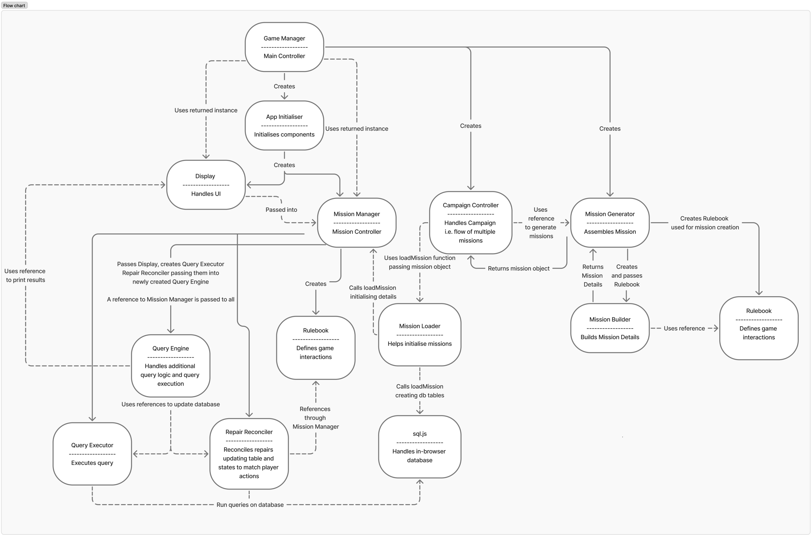

# StarQuery

StarQuery is an educational browser-based game that teaches SQL through spaceship maintenance and problem solving. Players use SQL queries to identify faults, repair ship systems, and record the impact of their repairs.

[Play StarQuery](https://devweb2025.cis.strath.ac.uk/~yfb21159/CS408Project/)

<br>

## Overview

StarQuery is an educational simulation game designed to help players develop practical SQL skills through an interactive problem-solving environment.

Players take the role of a crew officer responsible for maintaining a spaceship. Each mission presents the player with faults in the ship's systems, which they must investigate and resolve using SQL queries. Rather than requiring a specific query, the game evaluates the changes made to the underlying database state, allowing different valid approaches to solving a problem.

Missions are divided into three stages:

Identify — use SELECT queries to investigate the ship and identify faulty data.
Repair — use UPDATE queries to repair the identified faults.
Logging — record the impact of the repairs in the ship's logs.

Missions can be procedurally generated and can include additional rules that introduce dependencies and consequences between repairs.

<br>

## How It Works

Each mission is split into three stages, with the player using SQL to investigate and maintain the ship.

### 1. Identify

Players inspect the ship's modules and use SELECT queries to identify faulty fields and rows.

The Rulebook provides information about valid operating ranges, allowing players to reason about which values represent faults.

### 2. Repair

Once faults have been identified, players use UPDATE queries to repair the affected systems.

Repairs are evaluated based on the resulting database state rather than requiring one specific SQL query. This allows players to solve problems using different valid approaches.

Additional rules such as Critical Repair Order and Cascading Faults can introduce dependencies between repairs, creating consequences when faults are repaired incorrectly.

### 3. Logging

After repairs are complete, players use SQL to record their impact in the ship's logs.

The impact of repairs is calculated from the severity of the repaired faults and used to update the relevant ship sections.

<br>

## Technical Highlights

### Rulebook-driven architecture
A central Rulebook acts as the source of truth for the game's modules, valid operating ranges, dependencies and gameplay rules. The same definitions are consumed by mission generation, fault detection, repair validation, cascading faults, repair-order rules and contextual hints, keeping the behaviour of the different systems consistent.

### State-based SQL evaluation
Rather than requiring players to produce one predetermined SQL query, StarQuery evaluates the effect of their commands. The system captures the database state before a mutation, executes the player's SQL, then compares the resulting state against the previous state. The Repair Reconciler uses these changes together with the Rulebook to determine which faults were repaired, which fields were incorrectly modified and what gameplay consequences should occur.

### Procedural mission generation
Missions are constructed dynamically from the player's progression, available ship modules and difficulty. Valid rows and fault values are generated from the Rulebook, while fault density and ambiguity are adjusted as difficulty increases, allowing the game to produce varied missions without relying entirely on predefined scenarios.

### Rule-based fault escalation
Repairs can have consequences beyond simply changing a value. Dependency relationships and special rules such as Critical Repair Order and Cascading Faults can cause additional faults to appear when the player violates the system's constraints.

### Client-side SQL execution
SQL.js/WebAssembly provides an in-browser SQLite database, allowing player queries to execute immediately without requiring a backend database or server-side query processing.

<br>

## Architecture

StarQuery is organised as a set of modular components responsible for different parts of the game. The main systems communicate through defined responsibilities, while the Rulebook provides shared definitions and rules used throughout the application. 

The diagram below illustrates the relationships between the major components of StarQuery and how responsibility is divided across the application.




The Game Manager acts as the main application controller, coordinating initialisation and the creation of the major game components. The mission and campaign systems are separated into dedicated components for generating, building and loading missions, while the Rulebook provides shared definitions for the ship's modules, valid operating ranges and gameplay rules.

The query system is separated from the rest of the game logic. Player SQL is processed through the Query Engine and Query Executor, which execute queries against the in-browser sql.js database. Database state is then compared before and after player actions, allowing the Repair Reconciler to determine which faults were repaired and whether any additional gameplay rules have been triggered.

This separation of responsibilities keeps the user interface, mission system, game rules and database operations as distinct components while allowing them to communicate where required.

<br>

## Technical Deep Dive

### Rulebook System

The Rulebook acts as a central source of truth for the rules governing the game. It defines the ship's modules and fields, valid operating ranges, field dependencies and the conditions used to determine whether values are faulty.

Rather than duplicating these rules across individual components, other systems use the Rulebook when they need to make decisions about the game state. Mission generation uses it when creating valid and faulty data, while query handling and repair validation use it to determine whether player actions have produced valid repairs. The same definitions are also used by systems such as fault spawning and hints.

This approach keeps the behaviour of different parts of the application consistent. Changes to a rule can be made in one central location rather than requiring the same logic to be updated across multiple components.

### State-Based Repair Evaluation

A key part of StarQuery is that players are not required to use one specific SQL query to repair a fault. Instead, the game evaluates the changes made to the database state.

When a player executes a query that can modify the database, the Query Engine first captures the current state of the relevant tables. The Query Executor then executes the player's SQL against the in-browser database. After execution, the resulting state is compared with the captured state to determine what the player actually changed.

The Repair Reconciler processes these changes alongside the rules defined by the Rulebook. It identifies transitions from faulty to valid values as repairs, while also detecting invalid changes, modifications to non-faulty fields and changes that trigger additional gameplay rules.

This approach separates SQL execution from game-state evaluation. The database is responsible for applying the player's query, while the surrounding game systems interpret the resulting state and determine whether the player's actions constitute valid repairs.

This also allows players to solve a problem using different valid SQL approaches, as the game evaluates the resulting state rather than comparing the player's query against a predetermined answer.

### Procedural Mission Generation

StarQuery can generate missions dynamically rather than relying entirely on a collection of predefined scenarios. The Mission Generator coordinates the creation of the components required to construct a mission, including the Rulebook, Row Populator and Mission Builder.

The Row Populator uses the rules defined by the Rulebook to generate valid module data and introduce appropriate faults. The Mission Builder then assembles these generated components into a complete mission, with the difficulty configuration controlling factors such as fault density, the maximum number of faults and ambiguity in the generated data.

This allows missions to vary while remaining consistent with the rules of the game. It also means that increasing difficulty can change the complexity of generated missions without requiring each variation to be manually designed and stored.

### Fault Dependencies and Escalation

StarQuery supports gameplay rules that create dependencies between faults and repairs, making the order and consequences of player actions important.

One example is Critical Repair Order, where certain faults must be repaired before others. If a player repairs a lower-priority fault while a more critical fault remains unresolved, the game can respond by introducing an additional fault.

Cascading Faults provide another form of dependency, allowing changes to one part of the ship to cause faults elsewhere when the relevant conditions are met. The Fault Spawner and Repair Reconciler work with the Rulebook to determine when these consequences should occur.

These systems allow the database state to drive changes in the game rather than treating each fault as an isolated problem. As a result, players must consider both the immediate effect of a repair and its potential consequences for the rest of the ship.

### Scoring and Progression

Player performance is tracked throughout a mission and contributes to the game's progression systems. Repair efficiency is affected by actions such as modifying non-faulty data, repairing incorrectly and triggering additional faults, allowing the game to reward accurate and efficient problem solving rather than simply completing a mission.

Mission progress is tracked across the Identify, Repair and Logging stages, with progression only occurring when the relevant conditions have been satisfied. The resulting performance data is also used by the wider game systems to track player statistics, achievements and campaign progression.

This connects the underlying database state and repair evaluation systems to the player's overall experience, allowing technical actions performed through SQL to directly influence gameplay outcomes.

<br>

## Technologies

- **JavaScript** — Core application and game logic.
- **HTML** — Structure of the browser-based interface.
- **CSS** — Interface styling and layout.
- **SQL** — Used by players to investigate and modify the ship's database.
- **SQL.js** — In-browser SQLite database powered by WebAssembly, allowing SQL queries to be executed directly in the browser.
- **Git / GitHub** — Source control and project repository. 

<br>

## Running the Project

### Prerequisites

The project requires:

- **Python 3** — used to run a local HTTP server for the browser application.
- **Node.js and npm** — required only for installing and running the automated tests.

### Running Locally

1. Clone the repository and navigate to the project root, where `index.html` is located.
2. Start a local HTTP server:

```bash
python -m http.server 8000
```
Open the application in a browser at:
http://localhost:8000/

The project should now load and be playable in the browser.

Note: The game should be run through a local HTTP server rather than opening index.html directly, as the application requires access to the SQL.js WebAssembly files.

Running Tests

Install the Node.js dependencies:

npm install

Then run the automated test suite:

npm test

The tests use Jest and cover areas including query execution, repair logic and repair efficiency tracking.

SQL.js Files

The dist/ directory must contain the following files for the database functionality to work:

dist/
├── sql-wasm.js
└── sql-wasm.wasm

These files are required by SQL.js to initialise the in-browser SQLite database.
